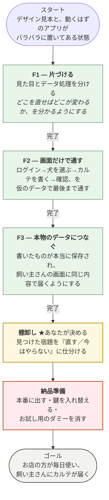

# 全体計画 — スタートからゴールまで

> **これは「今どこに居るか」を1枚で見るための地図。**
> 細かい作業は書かない（それは `docs/ops/plan.md` と `docs/deferred.md`）。
> ここに書くのは、**非エンジニアが読んで判断できる粒度**だけ。
>
> **出すとき**: ①「全体計画を見せて」と言われたとき ②フェーズが終わったとき
> ③チェックイン／チェックアウトのとき。
> 現在地は `docs/ops/phase` の1行から機械で読む（`npm run plan`）。

---

## 全体像

**いま居るのは「棚卸し」の入口です。** F1・F2・F3 は終わっています。

---

## フェーズごとの宿題（概要だけ）

| | やること | 終わったと言える条件 | 状態 |
|---|---|---|---|
| **F1** | 見た目とデータ処理を分ける | 混ざっている場所が0になる | ✅ 終わり |
| **F2** | 画面だけで最後まで通す | 「最後まで行けるか」「間違えても2タッチで戻れるか」が両方○ | ✅ 終わり |
| **F3** | 本物のデータにつなぐ | F2 の2つが、**本物のデータでも**両方○ | ✅ 終わり |
| **棚卸し** | 残っている宿題を仕分ける | あなたが全部に「直す／やらない」を付けた | ⬜ ここ |
| **納品準備** | 本番に出せる状態にする | 下の4つが全部済んだ | ⬜ |

### 棚卸しで決めてもらうこと（大きいものだけ）

1. **鍵の入れ替え** — 3種類。1つは「全部の鍵を素通りする合鍵」なので、**本物のお客様の情報を入れる前に必ず**。あなたの作業です。
2. **本番に残っているお試し用のダミー犬3頭**を消すか
3. そのほか（画面の細かい欠け・後回しにしたもの）を仕分け

> **件数はここに書かない。** 書いた瞬間から古くなる（実際、書いた直後にズレた）。
> いつでも `npm run plan` が台帳から数え直して出す。

### 納品準備でやること

| # | やること | いまの状態 |
|---|---|---|
| 1 | **本番に出す** | ❌ **本番はまだ古い版のまま。**いま作ったものは一度も出していない |
| 2 | 鍵を入れ替える | ❌ あなたの作業 |
| 3 | ダミーを消す | ❌ |
| 4 | 壊れたら自動で気づく仕組み | ✅ 済み（毎回15種類の検査が自動で走る） |

---

## この地図の読み方

- **緑** = 終わった作業
- **黄色（★）** = あなたが決めないと先に進めないところ
- **赤** = 納品前に必ず済ませるところ
- **❌** = まだ済んでいない

**「終わった」の意味を1つに決めてあります**——コードが書けたことではなく、
**画面の写真で「使える」と確認できたこと**（`AGENTS.md` D-14）。
F1〜F3 が全部✅なのは、その確認を通ったからです。
